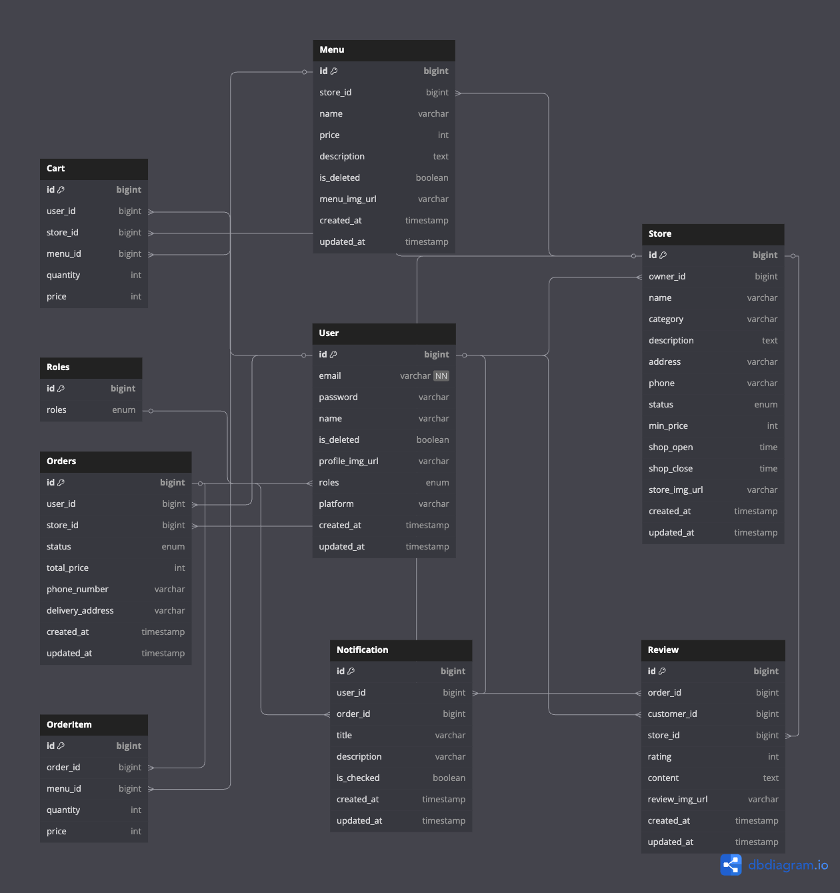

---

# Outsourcing Platform Backend - 내일배움캠프 6기 25조 아웃소싱 프로젝트

## 멤버

- [김태익](https://www.notion.so/teamsparta/25-1d62dc3ef51480b8a3dbec1e3c747ae7)
- [김예은](https://yeunever.tistory.com/)
- [박경오](https://velog.io/@chat27/posts)
- [박화랑](https://github.com/hugecookie)

자세한 정보를 원하신다면 각 멤버를 클릭해 확인해주세요!!

## Tech Stack

---

## ERD

---

## 주요 Features

### 회원 (User)

- 회원 가입 (소셜 로그인 + 일반 가입 지원)
- 회원 정보 수정
- 회원 탈퇴 (비밀번호 확인 후)
- 로그인 및 인증/인가 관리 (JWT 기반)
- 프로필 이미지 업로드 (AWS S3 Presigned URL 활용)

### 가게 (Store)

- 가게 생성 및 수정 (사장님 권한 필요)
- 가게 단건 및 다건 조회
- 가게 폐업 처리 (Soft Delete)

### 메뉴 (Menu)

- 메뉴 등록 및 수정
- 메뉴 삭제 (Soft Delete)
- 가게와 함께 메뉴 리스트 조회

### 주문 (Order)

- 고객 주문 생성 (최소 주문 금액 검증)
- 주문 상태 변경 (주문 수락/조리완료/배달중/배달완료)
- 주문 상태 변경 시 알림 전송 (선택 구현)

### 리뷰 (Review)

- 배달 완료 주문에 대해 리뷰 작성
- 리뷰 별점 조회 (3~5점 필터링 지원)
- 가게별 리뷰 최신순 조회

### 알림 (Notification)

- 주문/배달 상태에 따른 알림 생성
- 개인 알림 조회 및 읽음 처리
- 알림 소유자 검증 강화

---

## API Reference

- 전체 API 명세서 문서는 아래 링크를 참고해 주세요.
- git clone을 받으신다음 build.gradle후에 실행하시면 아래 링크로 접속해주세요!
- [API Documentation (Swagger)](http://localhost:8080/swagger-ui/index.html#/)  
  (※ 실제 배포/테스트 환경에 따라 URL 수정)

---

# 🛠 참고

- 소셜 로그인(Google, Kakao) 지원
- signed URL 방식으로 이미지 업로드 관리
- Spring Security + JWT + Redis 통합 인증 인가 구현
- 비즈니스 로직 구조 개선
- 알림 기능 구현
- GitHub Issue 기반 협업 진행

---

 - 프로젝트 진행상황을 자세히 확인하시고 싶으시다면 [과제의 민족](https://www.notion.so/teamsparta/25-1d62dc3ef51480b8a3dbec1e3c747ae7) 클릭!
